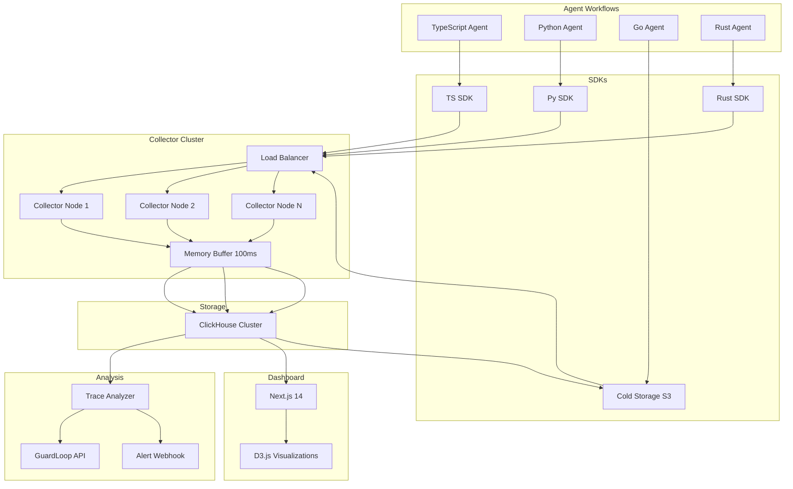

# Architecture

## System Design

## Data Flow

1. Agent emits spans via SDK
2. SDK batches spans (100ms window or 100 spans)
3. Collector receives via OTLP/gRPC or HTTP JSON
4. Collector validates schema, enriches with metadata
5. Buffer flushes to ClickHouse every 100ms
6. Trace Analyzer runs background jobs on new traces
7. Dashboard queries ClickHouse via REST API
8. Cold data archived to S3 after 30 days

## Component Responsibilities

| Component | Language | Responsibility |
|-----------|----------|--------------|
| Collector | Node.js | Ingestion, buffering, auth, schema validation |
| ClickHouse | SQL | Storage, time-series queries, aggregations |
| Analyzer | Node.js | Anomaly detection, failure signatures, alerts |
| Dashboard | Next.js + D3 | Visualization, search, replay |
| SDKs | TS/Py/Go/Rust | Client-side span creation and batching |
